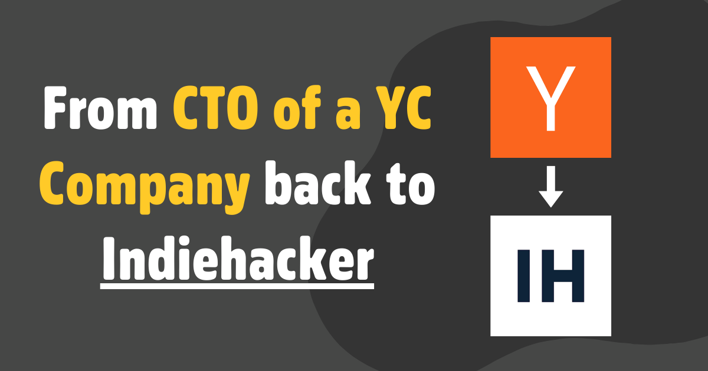

TLDR; Worked as a CTO of a YC-backed company but broke up with my co-founder due to a difference in values. Now I'm helping developers build their startups.

<!-- truncate -->

## Pre-breakup
A couple of months ago, my co-founder and I were working on an AI education startup. We were YC-backed, grew to [50,000 users](how-i-reached-50k-users-with-flutter.md), and earned $10,000 in revenue in under three months. All these metrics seemed to point towards a product with product-market fit, yet we were far from achieving that. We found ourselves behind in a rat race with a handful of competitors. Our runway was nearly depleted as we were spending almost all of our revenue on marketing, and we found ourselves at the intersection of the two most challenging spaces to build a startup: education and consumer. This combination, especially without a targeted niche, made it difficult to stand out in a crowded market.

For these reasons, we decided to explore new opportunities. But, as we were pivoting I realized we had little alignment on direction and ideas. It was clear that we fundamentally wanted different things from startups. His focus was to grow big and it didn't matter what he worked on while I wanted to solve problems meaningful to me. Eventually, I decided that splitting up was the right choice because our differences in values and goals would lead to unhappiness and waste both our time.

## What I learned:
- There's a lot of vanity metrics out there and oftentimes they don't paint the full picture
- It's way better to focus on a tighter niche
- Don't join a rat race unless you have a competitive advantage that will bring you to #1
- Aligning on goals and values are super important in a co-founder relationships

## What I'm up to now.
After breaking up with my co-founder, my immediate plan was to create boilerplate code for future startups, share it with folks, and earn a little bit of cash. But what I found was that I found real joy in helping these developers launch their startups. So now I'm on a mission to *help developers build startups*.

Here are some initiatives I've started in the past month:
- [Compiled a personal list of startup resources](https://devtodollars.com/blog/resources-for-founders-at-every-stage)
- [Open-sourced my startup boilerplate code](https://github.com/devtodollars/startup-boilerplate)
- [Created a discord community of entrepreneurial developers](https://discord.gg/Fw4rxWBTGU)
