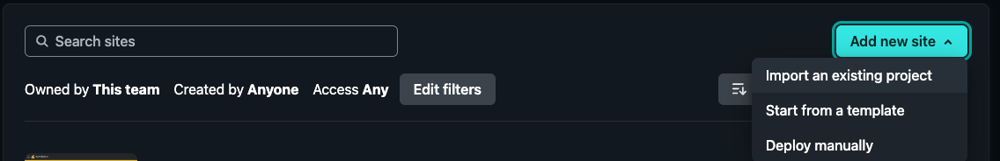
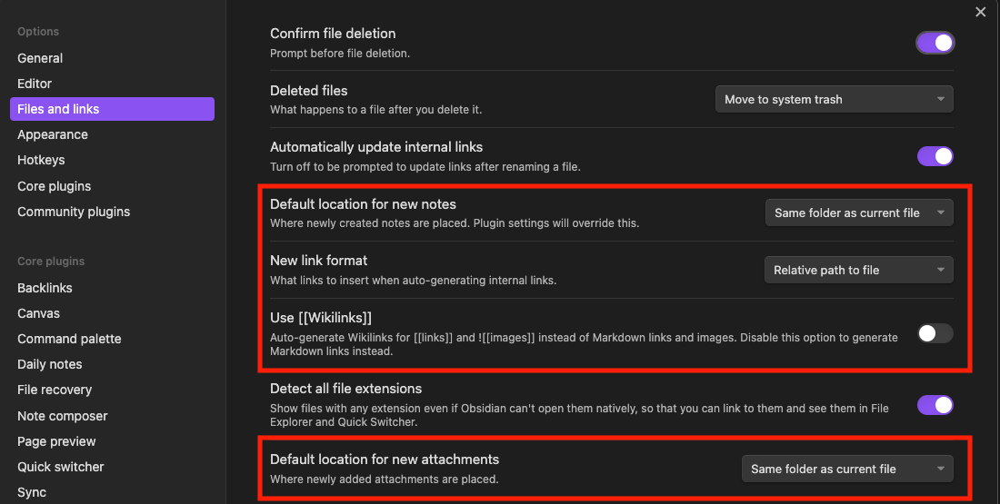

# Landing Page (Docusaurus)
I chose [Docusaurus]() because I wanted a customizable documentation website that where I can use [Github](https://github.com) and [markdown](https://www.markdownguide.org/) as my CMS. Other solutions I found weren't customizable enough and/or didn't have the built-in SEO (e.g. blog or documentation) I needed.

## 1. Setup Docusaurus
By the end of this setup you will have a deployed version of docusaurus.
1. Click `Use this template` in the [boilerplate repository](https://github.com/devtodollars/startup-boilerplate). This repository is where the publishing will occur.
2. Once you've cloned the repository head over to [Netlify](https://netlify.com) > Add New Site > Import an existing project

3. Select `Deploy with Github` and select the repository you just created
4.  Set the base directory, build command, and publish directory as seen below.

4. Click "Deploy" and wait for your site to be published!

## 2. Setup remote repository
By the end of this setup you will have a repository that contains all your resources that will deploy. 
1. Click `Use this template` in the [resources repository](https://github.com/devtodollars/resources). This is the repository where the contents of your blog and documentation will be updated.
2. Go to Netlify > Site Configuration > Build hooks and [create and copy a build hook](https://docs.netlify.com/configure-builds/build-hooks/)

3. In the cloned repository, [create a secret](https://docs.github.com/en/actions/security-guides/using-secrets-in-github-actions#creating-secrets-for-a-repository) called `NETLIFY_BUILD_HOOK`. Paste the build hook copied from the previous step. 
:::info
This build hook keeps the production deployment updated with the most recent changes in the resources repository
:::
4. To finalize the connection go to Netlify > Site configuration > Environment variables and [set the environemnt variable](https://docs.netlify.com/environment-variables/get-started/#create-environment-variables) `REMOTE_REPO_URL` as the URL of your repository.

5. Make a change your cloned Github repository and watch the changes propagate to your docusaurus website!

:::note
When running locally, set the `REMOTE_REPO_URL` to have your local changes be kept up to date
```
export REMOTE_REPO_URL=<INSERT_REMOTE_REPO_URL>
```
:::

## 3. Setup Obsidian as Docusaurus CMS
1. Install [Obsidian](https://obsidian.md/)
2. Go to Settings > Files and links, then update the following settings:

3. Install the [Obsidian Git](https://github.com/denolehov/obsidian-git/wiki/Installation) community plugin
:::info
If you don't know how to setup `git`, I encourage you to checkout my video on how to setup Obsidian and Git:
https://www.youtube.com/watch?v=5YZz38U20ws
:::
4. Run the command (CMD/Ctrl + P): `Clone an existing remote repo` and paste the remote repository url
5. Restart Obsidian
6. Make edits to your notes
7. Run the command `Obsidian Git: Create backup` by opening the command palette (CMD/Ctrl + P) to publish your notes
